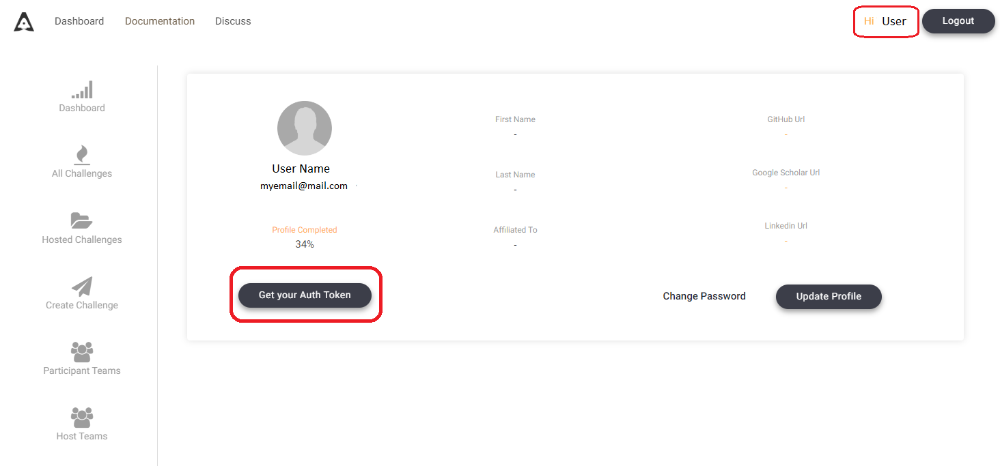
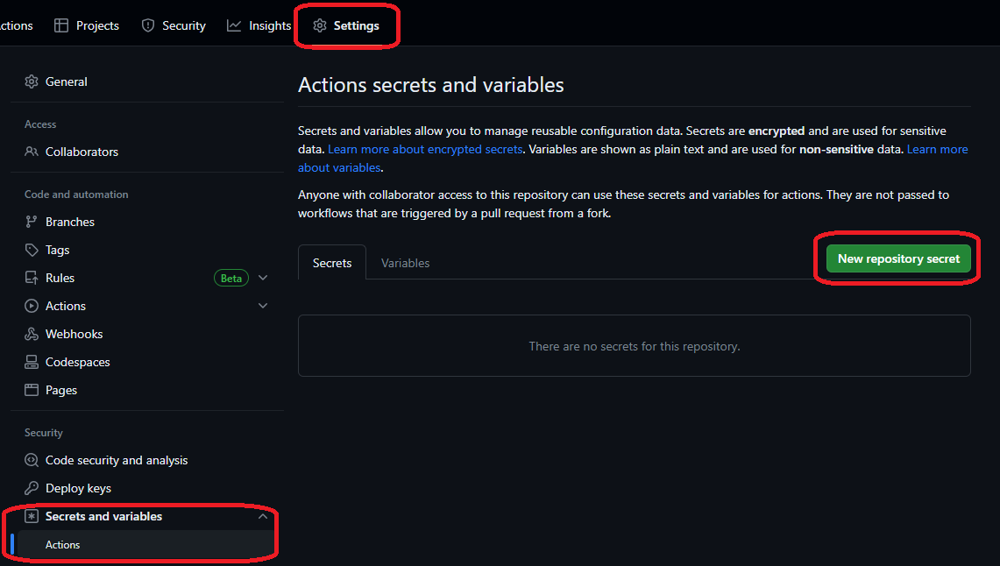
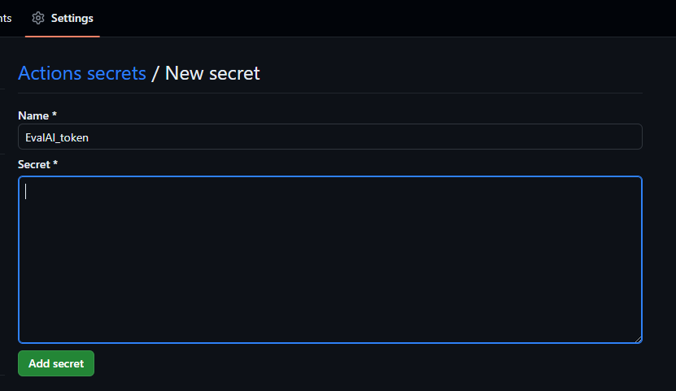

# Tutorial for submissions via Github (GH) actions

## What and Why GH-actions?
Github-actions are automated processes that get executed on a Github web-server. 
They allow you to run code in a reproducible way and can simplify repetitive processes. 
We created a repository template (the one you're reading right now) which you can use to create your own repo, 
after which you can then setup your evalai account and use it to automatically submit your solutions, 
so you don't have to mess around with docker containers.

## How to set-up a repo for submssion with GH-actions

### On the eval-ai website
- [Create an account for eval-ai and a team](https://evalai.readthedocs.io/en/latest/participate.html)
- Head to the MyoChallenge2023 and click on participate. You can now see in the participate area (or in your evalai account settings) your `personal token`. This token will be needed so that the github repo can submit solutions in your name.

### Clone this repo
In order for your code to stay private, you can [create a repository from our template](https://github.com/new?template_name=myoChallenge2023Eval&template_owner=MyoHub) by looking at the top of this repository and click on "Use this template" -> "Create your own repository" and then choosing the private option.

  |  |
  |-|

### Add the `personal token` to your repo secret 
Navigate to the new personal github repository that you created from the template. 

- In the top bar, click on "Settings" and then look for "Secrets and variables" -> "Actions". Here, click on "New repository secret". As the name you can put "EvalAI_token", while the Secret should be your evalai access token. That's it!

  |  |  |
  |-|-|
  Navigate to repository secret page | Enter your EvalAI access token here

- click on "Actions" in the top-bar of your repo, and you will see the github-actions we prepared. You can use "Docker Build Test" [Loco](https://github.com/MyoHub/myoChallenge2023Eval/actions/workflows/docker-build_loco.yml) or [Mani](https://github.com/MyoHub/myoChallenge2023Eval/actions/workflows/docker-build_mani.yml) to test building docker containers for random agents.

  |  |
  |-|

- If you want to submit something, you can use "Submission Loco Deprl" or similar for Mani and for random agents. Try clicking on one of them and then on "Run workflow" on the right. This should show up as a private submission in your evalai leaderboard.

You can then edit the prepared files for [deprl](https://github.com/MyoHub/myoChallenge2023Eval/blob/main/agent/agent_loco_deprl.py) or [random](https://github.com/MyoHub/myoChallenge2023Eval/blob/main/agent/agent_loco_random.py) agents and use them to import your own policies. They also contain other helpful functions.

Pushing your changes and policies to the `main` branch will allow to submit them via the github actions. For local development, we recommend to follow the DIY submission [instructions](./DIY_Submission.md).
